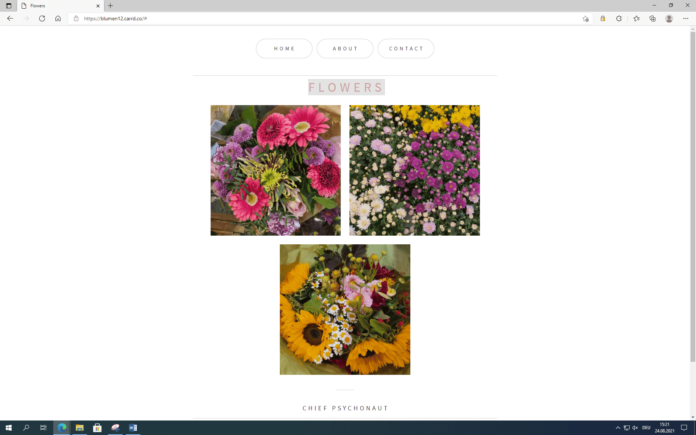
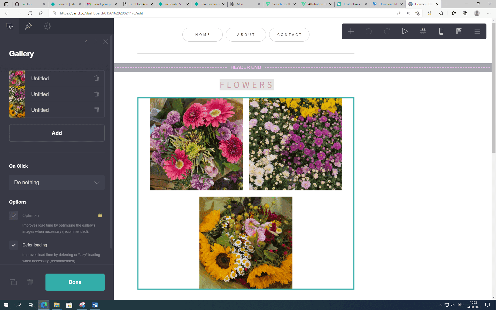

+++
title = "Erste Webseite für Blumenladen"
date = "2021-08-24"
draft = false
pinned = false
image = "blumen12.png"
description = "Erster Versuch"
+++

# Erlebnisse und Erfahrungen mit Webseitenprojekt

Unsere erste Aufgabe im WEB war, eine Webseite für einen Blumenladen zu erstellen. Zuerst gingen wir Blumen fotografieren, Danach ging es schon los mit der Eigenen Webseite erstellen.

Wir kreierten die Webseite mit Carrd.co. Mit Carrd.co kann man mit einfachen Tools eine Webseite designen und erstellen.

Anfangs war es ein bisschen schwierig, doch mit der Zeit ging es. Wir gestalteten die Webseite schlicht und simpel.