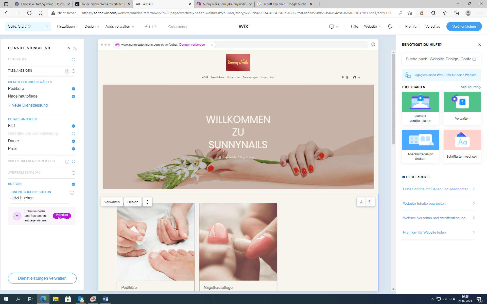

+++
title = "Website am entwerfen"
date = "2021-09-21"
draft = false
pinned = false
image = "screen.png"
+++
Heute haben wir gestartet die Website für unseren Kunden zu entwerfen. Die Website erstellen wir mit [wix.com](wix.com). 

Mit [wix.com](wix.com) ist es sehr einfach eine Webseite zu erstellen. Wir haben das Design und das Layout schon ausgewählt.

Wir haben unseren Kunden mit geteilt , dass wir in den nächsten drei Wochen eine Pause machen werden, da wir Ferien haben.

Ausserdem haben wir mit unserem Projektablauf gestartet.